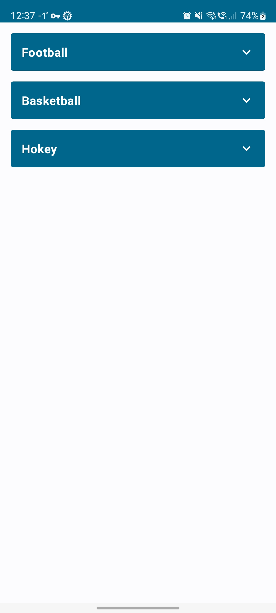
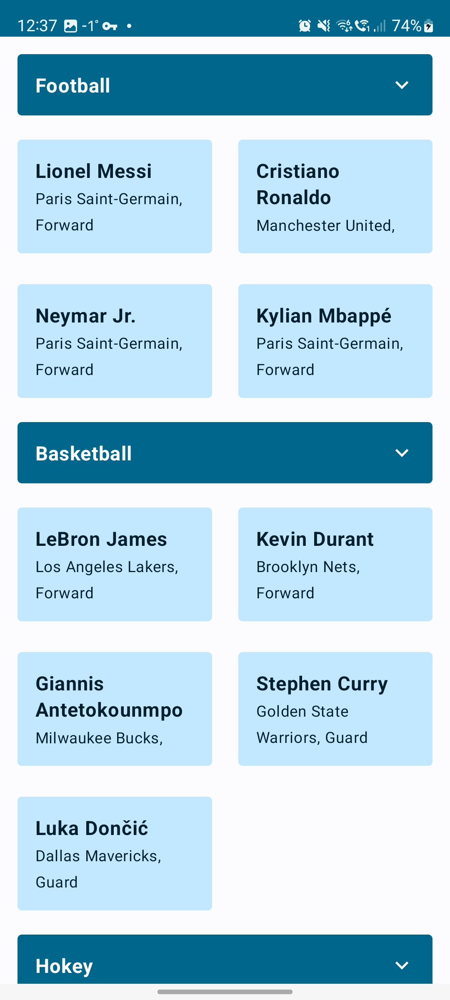

# Expandable Lazy Items

The application shows an example of how to implement expandable Lazy List with items, sorted by some category , at the same time, keep the benefits of lazy loading and not lose performance. LazyList item when clicked, an element is expanded and a list of more elements designated by key is added.

## About

### Functionality
- Expandable Lazy Items
- Lazy Grid

### UI
- [Material 3](https://m3.material.io/develop/android)